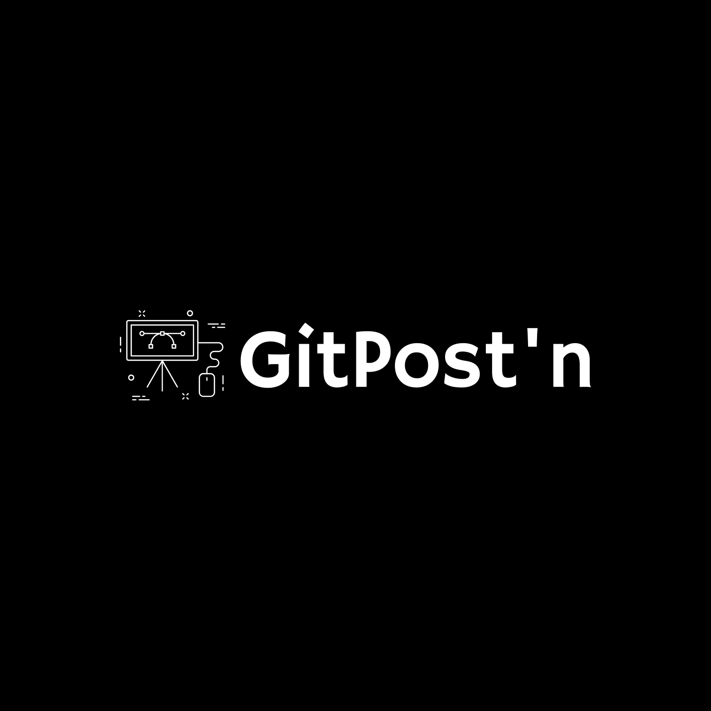

   <!-- <h1>GitPost'n</h1> -->
   

   

GitPost'n is a collaborative platform offering developers a space to share code, collaborate on projects, and engage in discussions within the tech space. 

<!-- 

   

 -->

# Overview

### :dart: Features:

Team Forward allows users to:
- Create account
- Sign in
- Read all posts
- Create a new post
- Like other posts

### Dependencies:

  
Client

  <ul>
    <li>Javascript</li>
    <li>HTML</li>
    <li>CSS</li>
    <li>Bootstrap</li>
    <li>Bootswatch</li>
  </ul>

  
Server

  <ul>
    <li>MySQL</li>
    <li>Node.js</li>
    <li>MicroBlogLite Api</li>
  </ul>

<!-- Contributing -->
## 🛠 The Team (3 little 🐷)

### Developers
- [Hanson](https://github.com/hansontram) 🤓
- [Elvis](https://github.com/VVSteven) 😎
- [Juan](https://github.com/0zoneGG) 🤠

#### Special shoutout and thank you to [Gregor](https://github.com/hansontram) the best instructor and Year Up for the opportunity!

